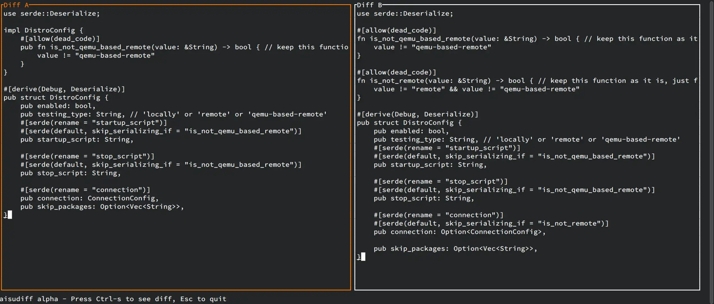
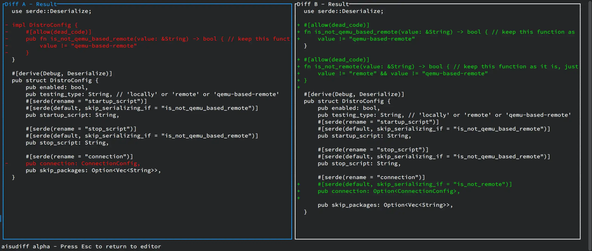

# aisudiff
TUI diff tool/scratchpad, but for arbitrary contents pasted from clipboard.

See it in action (before/after): 

## Usage
Its usage should be quite self-explanatory; Edit or paste contents into the two panels and hit Ctrl-s to view the diff results.

## Future plans?
`ratatui` is a neat framework, but however drastically lacks usable widgets; Even a simple editable textbox with features such as word wrapping/mouse scrolling/bracket pasting/etc cannot be done with both `ratatui::Paragraph` and [tui-textarea](https://github.com/rhysd/tui-textarea)/[tui-scrollview](https://github.com/joshka/tui-widgets).

Bruh.

I have some ideas of features to implement but are all unfortunately put on hiatus due to the above reason. Argh... when will we be able to get a truly usable Rust TUI framework...